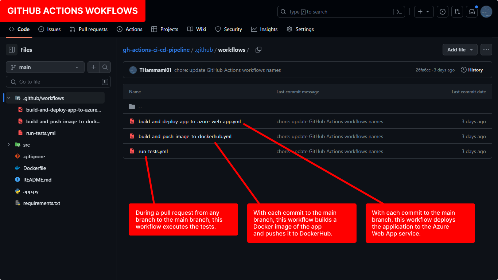
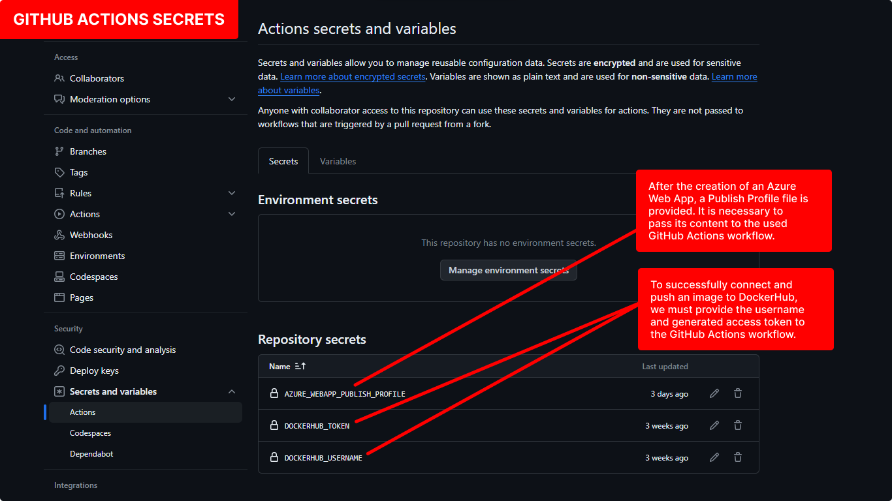
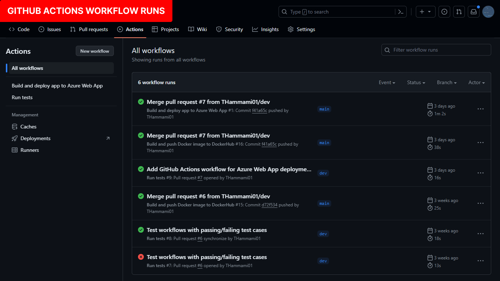
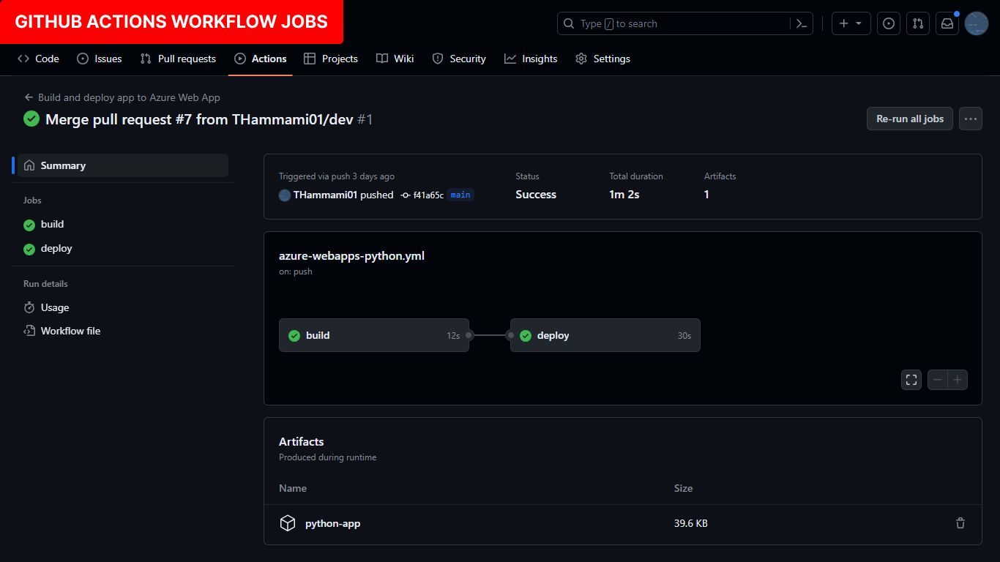
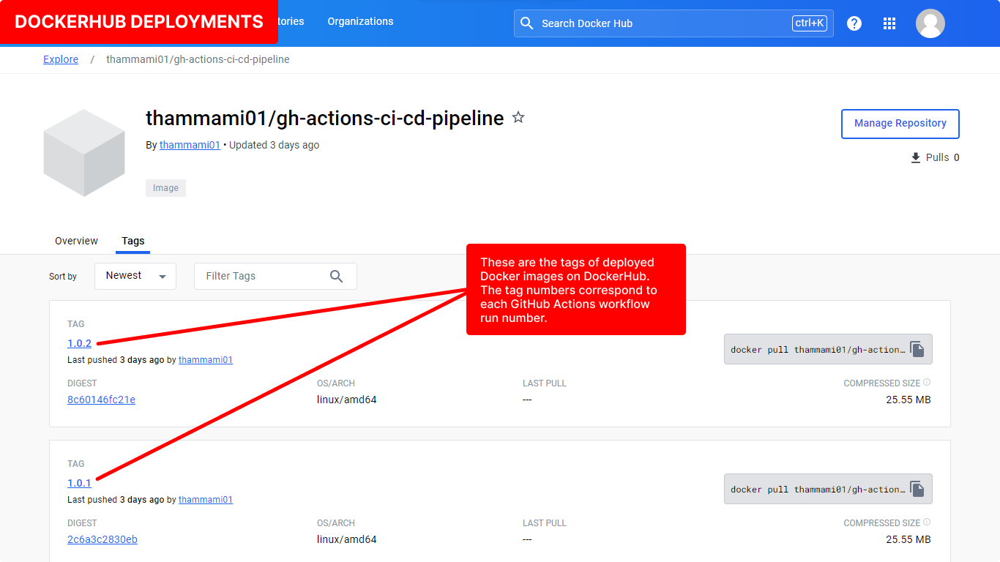
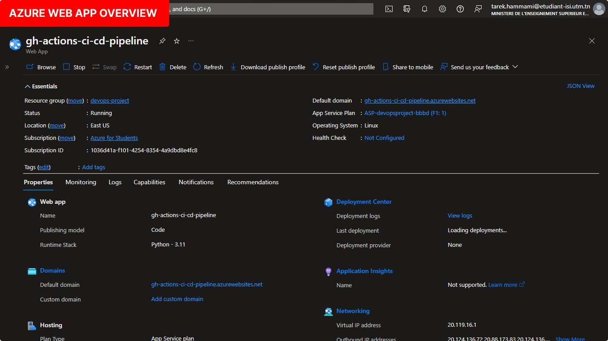
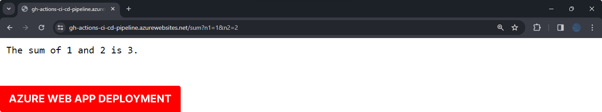

# GitHub Actions CI/CD Pipeline

 

This repository contains the source code for a simple Flask (Python) app, including a CI/CD pipeline implemented through GitHub Actions that will run tests, build Docker image and push it to DockerHub, as well as deploy the app to Azure Web App service.

